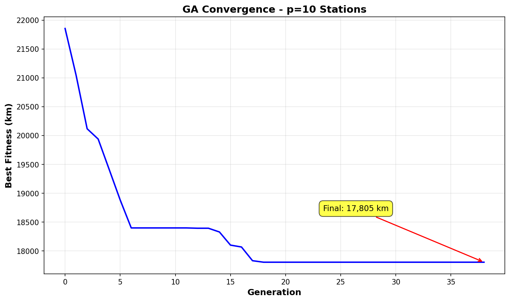
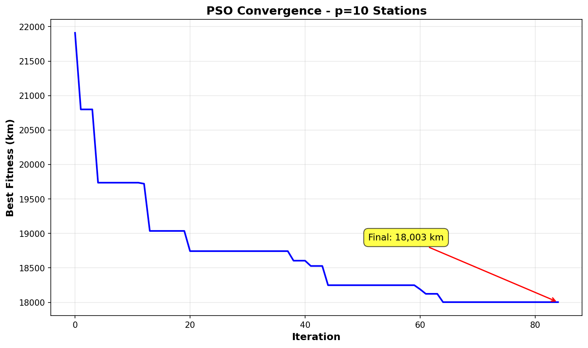
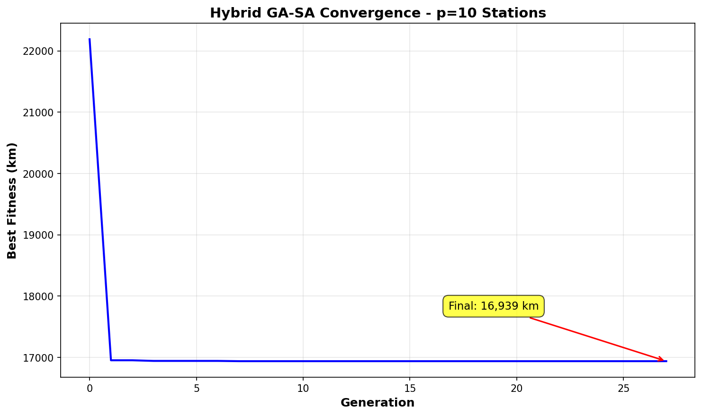
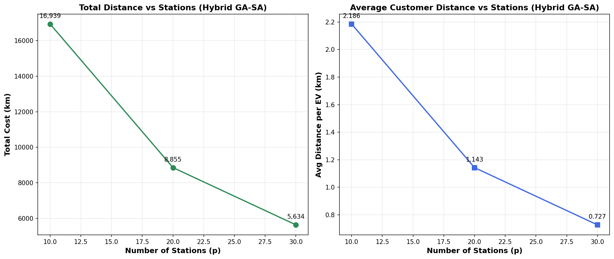

# Optimal EV Charging Station Placement using Metaheuristic Algorithms

## Overview

This repository contains a benchmarking study of three metaheuristic algorithms for solving the **p-median problem** applied to optimal EV charging station placement in Delhi, India. We implement and compare:

- **Genetic Algorithm (GA)** – population-based evolutionary approach
- **Particle Swarm Optimization (PSO)** – swarm intelligence for spatial search
- **Hybrid Simulated Annealing-Genetic Algorithm (SA-GA)** – combined local-global optimization

All algorithms minimize weighted customer travel distance to selected charging stations using real Delhi city geographic and demand data.

---

## Problem Statement

### The p-Median Problem

Given:

- A set of candidate locations for EV charging stations
- A set of demand points (customer locations) with associated demand weights
- A parameter **p** (number of stations to select)

**Objective:** Select exactly **p** stations that minimize the total weighted distance from each demand point to its nearest selected station.

**Motivation:** Optimal placement reduces customer travel burden, improves infrastructure accessibility, and maximizes EV adoption across urban areas.

---

## Algorithms

### Genetic Algorithm (GA)

- **Approach:** Population-based evolutionary computation with selection, crossover, and mutation
- **Role:** Benchmark algorithm; demonstrates classical evolutionary optimization
- **Strengths:** Robust global search; well-understood behavior
- **Limitations:** Slower convergence on large search spaces

### Particle Swarm Optimization (PSO)

- **Approach:** Simulates social behavior of bird flocking; particles explore solution space with velocity updates
- **Role:** Fast spatial search with minimal hyperparameters
- **Strengths:** Quick convergence; effective for continuous-like discrete problems
- **Limitations:** May converge prematurely to local optima

### Hybrid Simulated Annealing-Genetic Algorithm (SA-GA)

- **Approach:** Combines SA's local search refinement with GA's population diversity
- **Role:** Advanced hybrid method balancing exploration and exploitation
- **Strengths:** Superior convergence quality; escapes local optima effectively
- **Findings:** Achieves best solution quality across most p values

---

## Repository Structure

The repository follows a **fully modular design**, with each algorithm directory containing all necessary code, configuration, and outputs for independent experimentation and analysis.

```
EV-Charging-Station-Comparative-Study/
│
├── dataset/                           # Root data directory
│   └── delhi_data.csv                # Candidate station coordinates & demand points
│
├── GA/                                # Genetic Algorithm module
│   ├── genetic_algorithm.py          # Main GA implementation
│   ├── config.py                     # GA hyperparameters (population size, mutation rate, etc.)
│   ├── fitness.py                    # p-median objective evaluation
│   ├── operators.py                  # Selection, crossover, mutation, population creation
│   ├── visualization.py              # Plotting convergence & station placement maps
│   ├── requirements.txt               # GA-specific dependencies
│   └── results/                      # Algorithm outputs
│       ├── convergence_p10.png       # Fitness evolution plots
│       ├── station_placement_p10.html # Interactive maps
│       └── metrics_summary.csv        # Performance metrics
│
├── PSO/                               # Particle Swarm Optimization module
│   ├── pso.py                        # Main PSO implementation
│   ├── config.py                     # PSO hyperparameters (inertia, cognitive/social coefficients)
│   ├── fitness.py                    # p-median objective evaluation
│   ├── operators.py                  # Particle initialization, velocity/position updates
│   ├── visualization.py              # Plotting convergence & station placement maps
│   ├── requirements.txt               # PSO-specific dependencies
│   └── results/                      # Algorithm outputs
│       ├── convergence_p10.png
│       ├── station_placement_p10.html
│       └── metrics_summary.csv
│
├── GA-SA/                             # Hybrid Simulated Annealing-Genetic Algorithm module
│   ├── ga-sa.py                      # Main SA-GA implementation
│   ├── config.py                     # SA-GA hyperparameters (temperature schedule, cooling rate)
│   ├── fitness.py                    # p-median objective evaluation
│   ├── operators.py                  # SA local search, GA crossover/mutation blend
│   ├── visualization.py              # Plotting convergence & station placement maps
│   ├── requirements.txt               # SA-GA-specific dependencies
│   └── results/                      # Algorithm outputs
│       ├── convergence_p10.png
│       ├── station_placement_p10.html
│       └── metrics_summary.csv
│
├── requirements.txt                   # Global dependencies (pandas, numpy, matplotlib, etc.)
├── .gitignore                         # Git exclusions
└── README.md                          # This file
```

### Directory Descriptions

| Directory       | Purpose                                                                                    |
| --------------- | ------------------------------------------------------------------------------------------ |
| **dataset/**    | Stores all input data (Delhi candidate stations and demand points)                         |
| **GA/**         | Complete Genetic Algorithm implementation with independent execution environment           |
| **PSO/**        | Complete Particle Swarm Optimization implementation with independent execution environment |
| **GA-SA/**      | Complete Hybrid SA-GA implementation with independent execution environment                |
| **\*/results/** | Contains convergence plots, station placement maps, and CSV metrics for each algorithm     |

### File Descriptions

| File                                           | Description                                                                                                               |
| ---------------------------------------------- | ------------------------------------------------------------------------------------------------------------------------- |
| `genetic_algorithm.py` / `pso.py` / `ga-sa.py` | Main algorithm runner; execute to launch optimization                                                                     |
| `config.py`                                    | Hyperparameter settings (iterations, population size, cooling schedule, etc.)                                             |
| `fitness.py`                                   | Haversine distance calculations and p-median objective function                                                           |
| `operators.py`                                 | Algorithm-specific operations (GA: selection/crossover/mutation; PSO: velocity updates; SA-GA: local search/hybrid moves) |
| `visualization.py`                             | Functions for generating convergence plots and interactive station placement maps                                         |
| `requirements.txt`                             | Python package dependencies for each module                                                                               |

---

## Installation & Setup

### Prerequisites

- Python 3.8+
- Libraries: `pandas`, `numpy`, `scikit-learn`, `matplotlib`, `folium` (optional for interactive maps)

### Installation

```bash
git clone https://github.com/your-org/EV-Charging-Station-Placement.git
cd EV-Charging-Station-Comparative-Study
pip install -r requirements.txt
```

### Configuration

Edit `config.py` to set:

- Population size & iterations
- p values to test (number of stations)
- Hyperparameters (GA: mutation rate; PSO: inertia, cognitive/social coefficients; SA-GA: temperature schedule)

---

## Running Experiments

Execute each algorithm independently:

```bash
# Run Genetic Algorithm
python GA/genetic_algorithm.py

# Run Particle Swarm Optimization
python PSO/particle_swarm_optimisation.py

# Run Hybrid SA-GA
python GA-SA/ga-sa.py
```

All results are saved to respective `results/` directories.

---

## Outputs

### Per Algorithm Directory

Each `results/` folder contains:

| File                        | Description                                                 |
| --------------------------- | ----------------------------------------------------------- |
| `convergence_p*.png`        | Fitness evolution over iterations for p=3,5,7,10            |
| `station_placement_p*.html` | Interactive map showing selected stations & demand coverage |
| `metrics_summary.csv`       | Solution quality, coverage ratio, avg. travel distance      |

### Key Metrics

- **Fitness (Objective):** Total weighted travel distance
- **Coverage Ratio:** % of demand points within acceptable distance
- **Avg. Travel Distance:** Mean distance per customer to nearest station
- **Convergence Speed:** Iterations to reach near-optimal solution

---

## Comparative Results Summary

### Average Customer Distance vs Number of Stations

| p (Stations) | GA (km) | PSO (km) | SA-GA (km) | Best Algorithm   |
| ------------ | ------- | -------- | ---------- | ---------------- |
| 10           | 2.297   | 2.323    | 2.189      | **SA-GA** ↓ 4.7% |
| 20           | 1.187   | 1.346    | 1.143      | **SA-GA** ↓ 3.7% |
| 30           | 0.754   | 0.785    | 0.727      | **SA-GA** ↓ 3.6% |

### Convergence Performance (p=10 Stations)

| Algorithm | Final Fitness | Convergence Iterations | Final Value        |
| --------- | ------------- | ---------------------- | ------------------ |
| GA        | 17,805 km     | ~35 generations        | Plateaus early     |
| PSO       | 18,003 km     | ~90 iterations         | Steady descent     |
| **SA-GA** | **16,939 km** | ~25 generations        | **Fastest & Best** |

**Key Performance Insights:**

- **SA-GA Superiority:** Achieves 3.6–4.7% lower average customer distance across all p values

  - At p=10: SA-GA reaches 16,939 km vs GA's 17,805 km (5.1% improvement)
  - Consistent advantage maintained at p=20 and p=30

- **Convergence Comparison:**

  - **GA:** Slower convergence (~35 generations); plateaus around iteration 15
  - **PSO:** Moderate speed (~90 iterations); more gradual descent but higher final fitness
  - **SA-GA:** Fastest convergence (~25 generations); steepest initial drop with best final solution

- **PSO Trade-off:** While PSO converges faster initially, it settles at suboptimal solutions (~1–2% worse than SA-GA)

- **Scalability:** SA-GA maintains performance edge across increasing station counts, making it ideal for large-scale deployments

---

## Visualizations

### Convergence Plots (p=10 Stations)

|                           GA                            |                            PSO                            |                             SA-GA                             |
| :-----------------------------------------------------: | :-------------------------------------------------------: | :-----------------------------------------------------------: |
|  |  |  |

_Left: GA shows steady but slower improvement. Center: PSO reaches solution quickly but plateaus higher. Right: SA-GA combines rapid descent with superior final fitness._

### Average Distance Trends Across p Values



_All three algorithms improve customer accessibility as more stations are deployed; SA-GA maintains consistently lower distances._

### Sample Result Plots

View detailed results by opening files in respective directories:

```bash
# Convergence comparison (all algorithms at p=10)
GA/results/convergence_p10.png
PSO/results/convergence_p10.png
SA_GA/results/convergence_p10.png

# Distance metrics across p values
GA/results/avg_customer_distance_vs_stations.png
PSO/results/avg_customer_distance_vs_stations.png
SA_GA/results/avg_customer_distance_vs_stations.png

# Interactive station placement map
SA_GA/results/station_placement_p10.html
```

---

## Reproducibility

To reproduce results:

1. Ensure `data/delhi_data.csv` is present with candidate and demand coordinates
2. Keep `config.py` parameters consistent across runs
3. Run all three algorithms with the same seed (set in config)
4. Compare `metrics_summary.csv` outputs

---

## Requirements

See `requirements.txt`:

```
pandas>=1.3.0
numpy>=1.21.0
scikit-learn>=0.24.0
matplotlib>=3.4.0
folium>=0.12.0
```

---

**Lab/Course:** Optimization Techniques Lab
<br>
**Semester:** 5
